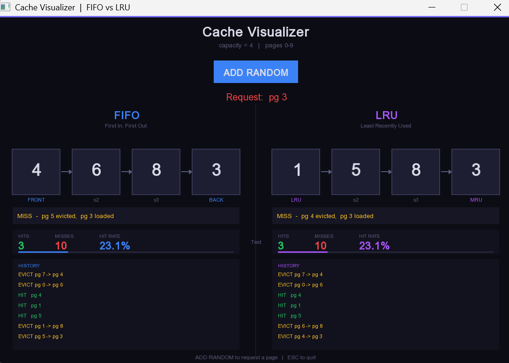

# Cache Visualizer

Interactive FIFO vs LRU Cache Visualizer built using C++ and SFML.

## Features

- FIFO Cache Simulation
- LRU Cache Simulation
- Hit/Miss Statistics
- Eviction Visualization
- Real-Time Comparison

## Technologies

- C++
- STL
- SFML

## Screenshots

